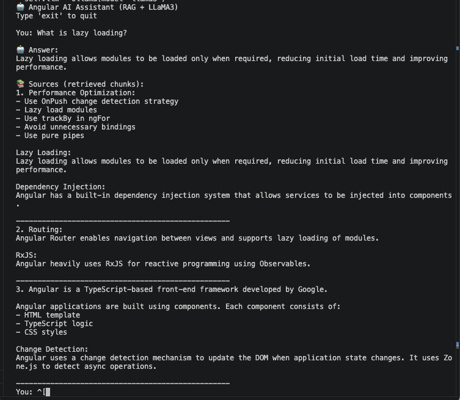

# RAG Angular Assistant using LLaMA3 + FAISS

A local Retrieval-Augmented Generation (RAG) assistant built using Python, FAISS, HuggingFace embeddings, and LLaMA3 via Ollama.  
The application provides context-grounded Angular answers using semantic search and local LLM inference without relying on external AI APIs.

---

## 📸 Demo



---

# 🚀 Features

- Local LLaMA3 inference using Ollama
- Retrieval-Augmented Generation (RAG)
- Semantic search using HuggingFace embeddings
- FAISS vector database integration
- Context-grounded response generation
- Hallucination control using strict prompt constraints
- Source traceability for retrieved chunks
- Modular Python project architecture
- Fully offline execution

---

# 🧠 Architecture

```text
User Query
    ↓
Embedding Generation
    ↓
FAISS Similarity Search
    ↓
Context Retrieval
    ↓
Prompt Injection
    ↓
LLaMA3 via Ollama
    ↓
Grounded Response
```

---

# 🛠 Tech Stack

| Technology | Purpose |
|---|---|
| Python | Core application |
| LangChain | RAG orchestration |
| FAISS | Vector similarity search |
| HuggingFace Embeddings | Semantic embeddings |
| Ollama | Local LLM runtime |
| LLaMA3 | Large Language Model |

---

# 📂 Project Structure

```text
rag-angular-assistant/
│
├── app/
│   ├── __init__.py
│   ├── ingest.py
│   ├── rag.py
│   └── main.py
│
├── data/
│   └── angular_docs.txt
│
├── vectorstore/
│
├── requirements.txt
├── README.md
└── .gitignore
```

---

# ⚙️ Setup Instructions

## 1️⃣ Clone Repository

```bash
git clone <your-repo-url>
cd rag-angular-assistant
```

---

## 2️⃣ Create Virtual Environment

```bash
python3 -m venv venv
source venv/bin/activate
```

---

## 3️⃣ Install Dependencies

```bash
pip install -r requirements.txt
```

---

## 4️⃣ Install Ollama

Install Ollama from:

https://ollama.com

Pull LLaMA3 model:

```bash
ollama pull llama3
```

---

## 5️⃣ Add Knowledge Base

Update:

```text
data/angular_docs.txt
```

with your own documents/content.

---

## 6️⃣ Run Document Ingestion

```bash
python app/ingest.py
```

This step:
- Loads documents
- Splits text into chunks
- Generates embeddings
- Stores vectors in FAISS

---

## 7️⃣ Start Ollama

Open a separate terminal:

```bash
ollama run llama3
```

---

## 8️⃣ Run Application

```bash
python -m app.main
```

---

# 💬 Sample Questions

- What is Angular change detection?
- What is lazy loading?
- How to optimize Angular performance?
- Explain Angular dependency injection.

---

# 🔒 Hallucination Control

The system uses strict prompt grounding rules:

- Answers are generated only from retrieved context
- If context is unavailable, the model returns:
  
```text
I don't know
```

This reduces hallucinated or fabricated responses.

---

# 📚 Retrieval Flow

```text
Documents
   ↓
Chunking
   ↓
Embeddings
   ↓
FAISS Vector Store
   ↓
Similarity Search
   ↓
Retrieved Context
   ↓
LLM Response
```

---

# 🧪 Example Output

```text
You: What is lazy loading?

🤖 Answer:
Lazy loading allows modules to be loaded only when required,
reducing initial load time and improving application performance.
```

---

# 🚀 Future Enhancements

- PDF ingestion support
- Multi-document retrieval
- Web UI using Streamlit
- Conversation memory
- LangGraph-based agent workflows
- Hybrid search (BM25 + Vector Search)
- Source citation ranking

---

# 🧠 Key Learnings

- RAG architecture implementation
- Vector databases and semantic retrieval
- Local LLM deployment using Ollama
- Prompt engineering and grounding
- Hallucination mitigation strategies
- Python modular architecture
- Real-world LangChain integration challenges

---

# 👨‍💻 Author

NA Eswari

Senior Full Stack / Angular Architect  
AI-driven Engineering | GenAI | MCP | RAG | Agent Systems

---

# 📄 License

MIT License
